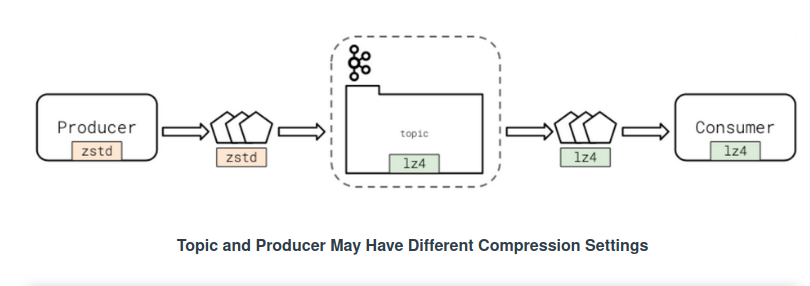
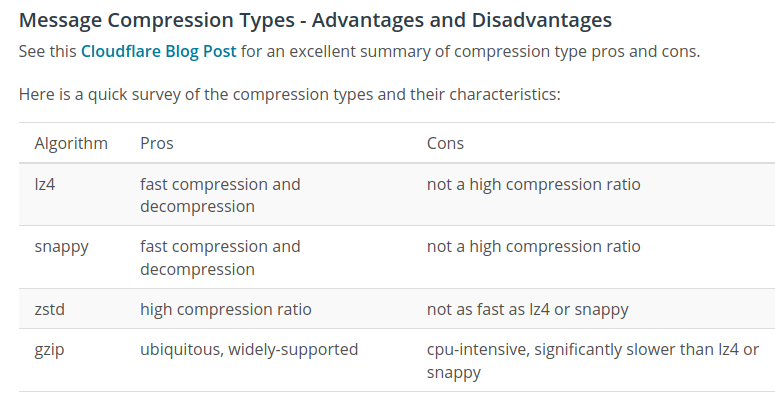

# Apache Kafka #


## Kafka Runs Anywhere ##


### Kafka Architecture

- Kafka servers are referred to as brokers
- All of the brokers that work together are referred to as a cluster
- Clusters may consist of just one broker, or thousands of brokers
- Apache Zookeeper is used by Kafka brokers to determine which broker is the leader of a given partition and topic
- Zookeeper keeps track of which brokers are part of the Kafka cluster
- Zookeeper stores configuration for topics and permissions (Access Control Lists - ACLs)
-     ACLs are Permissions associated with an object. In Kafka, this typically refers to a user’s permissions with respect to production and consumption, and/or the topics themselves.
- Kafka nodes may gracefully join and leave the cluster
- Kafka runs on the Java Virtual Machine (JVM)


### Kafka Clustering - Key Points ###


- Kafka servers are referred to as brokers and organized into clusters.
- Kafka uses Apache Zookeeper to keep track of topic and ACL configuration, as well as determine leadership and cluster management.
- Usage of ZooKeeper means that Kafka brokers can typically seamlessly join and leave clusters, allowing Kafka to grow easily as its usage increases or decreases.


### How kafka works - Summary ###


In this section we learned:

- A Kafka Broker is an individual Kafka server
- A Kafka Cluster is a group of Kafka Brokers
- Kafka uses Zookeeper to elect topic leaders and store its own configuration
- Kafka writes log files to disk on the Kafka brokers themselves
- How Kafka achieves scale and parallelism with topic partitions
- How Kafka provides resiliency and helps prevent data loss with data replication

How Kafka Works - Further Research

You might be interested in optional reading about some of these related topics, which are beyond the scope of this course:

- Why does Kafka need Zookeeper? : https://www.cloudkarafka.com/blog/2018-07-04-cloudkarafka_what_is_zookeeper.html
- Kafka Design: https://kafka.apache.org/documentation/#design
- Partitioning: https://kafka.apache.org/documentation/#intro_topics
- Data Replication: https://kafka.apache.org/documentation/#replication

## Partitioning Topics


- The “right” number of partitions is highly dependent on the scenario.
- The most important number to understand is desired throughput. How many MB/s do you need to achieve to hit your goal?
- You can easily add partitions at a later date by modifying a topic.
- Partitions have performance consequences. They require additional networking latency and potential rebalances, leading to unavailability.
- Determine the number of partitions you need by dividing the overall throughput you want by the throughput per single consumer partition or the throughput per single producer partition. Pick the larger of these two numbers to determine the needed number of partitions.
    - ```# Partitions = Max(Overall Throughput/Producer Throughput, Overall Throughput/Consumer Throughput)```
    - Example from video, with 3 Producers and 5 Consumers, each operating at 10MB/s per single producer/consumer partition: Max(100MBs/(3 * 10MB/s), 100MBs/(5 * 10MB/s)) = Max(2) ~= *4 partitions needed*

**Q&A**

1. 250MB/s with 10 producers and 12 consumers, how many partitions should my topic have? 25.
2. The following are benefits of partitions:
  - Increased parallelism and speed for consumers.
  - Increased parallelism and speed for producers.
  - Better topic scalability.
3. What are the potential drawbacks of using too many partitions?
  - More frequent rebalances
  - Decreased performance.
  - More networking overhead.


## Data Managements: Key Points ##

- Data retention determines how long Kafka stores data in a topic.
  - The retention.bytes, retention.ms settings control retention policy
- When data expires it is deleted from the topic.
  - This is true if cleanup.policy is set to delete
- Retention policies may be time based. Once data reaches a certain age it is deleted.
  - The retention.ms setting controls retention policy on time
Retention policies may be size based. Once a topic reaches a certain age the oldest data is deleted.
  - The retention.bytes setting controls retention policy on time
Retention policies may be both time- and size-based. Once either condition is reached, the oldest data is deleted.
Alternatively, topics can be compacted in which there is no size or time limit for data in the topic.
  - This is true if cleanup.policy is set to compact
- Compacted topics use the message key to identify messages uniquely. If a duplicate key is found, the latest value for that key is kept, and the old message is deleted.
- Kafka topics can use compression algorithms to store data. This can reduce network overhead and save space on brokers. Supported compression algorithms include: lz4, ztsd, snappy, and gzip.
  - compression.type controls the type of message compression for a topic
- Kafka topics should store data for one type of event, not multiple types of events. Keeping multiple event types in one topic will cause your topic to be hard to use for downstream consumers.


Way in which Kafka manages data:
- Deleting on time.
- Deleting on time and size
- Deleting on size.
- Never deleting records, but instead compacting duplicates based on key.


Schenario for time-based expiration:
- A topic intended to contain the last 24 hours of user purchase data.

Scenario would be appropriate for size-based expiration:
- topic receiveing extremely high throughput on a limited-resources machine.

Schenario for log-compaction:
A topic expected to hold a list of every country in the world.

Scenario for both time and size expiration:
- A high-throuhput topic running on limited-resources intended to contain the last 7 days worth of microservice logs. 

## Synchronous Porduction ##

Is not used that much but there's special cases for it's usage. 
- credit card transaction and the app requires a succesful msg delivery before moving on. 
- A stock-ticker update being delivered to the buying system at a financial company.
- An alerting event being delivered to a company's pager system. 


## Asynchronous Production ##


Useful when you want to maximize your throughput to Kafka with the least overhead in impact on the integrated application. 

Which would be appropriate?
- An event needs to be delivered denoting that a user performed a search on an app.
- An event needs to be delivered indicating that a user has logged out of our website.
- An event needs to be delivered indicating that a user completed 50 % of a video.


## Message Serialization ##


Common types of message serialization:
- Binary
- CSV
- Apache Avro
- String
- JSON






## Consumer Offsets ##


Kafka keeps track of what data a consumer has seen with offsets

- Kafka stores offsets in a private internal topic
- Most client libraries automatically send offsets to Kafka for you on a periodic basis
- You may opt to commit offsets yourself, but it is not recommended unless there is a specific use-case.
- Offsets may be sent synchronously or asynchronously
- Committed offsets determine where the consumer will start up
  - If you want the consumer to start from the first known message, [set auto.offset.reset to earliest]
  - This will only work the first time you start your consumer. On subsequent restarts it will pick up wherever it left off
  - If you always want your consumer to start from the earliest known message, you must manually assign your consumer to the start of the topic on boot. https://docs.confluent.io/current/clients/confluent-kafka-python/index.html?highlight=serializer#confluent_kafka.Consumer.assign

  
The **offset** is number stored in a private Kafka topic which identifies the last consumed message for consumer.


## Consumer Groups ##

- All Kafka Consumers belong to a Consumer group
  - The group.id parameter is required and identifies the globally unique consumer group
  - Consumer groups consist of one or more consumers
- Consumer groups increase throughput and processing speed by allowing many consumers of topic data. However, only one consumer in the consumer group receives any given message.
- If your application needs to inspect every message in a topic, create a consumer group with a single member
- Adding or removing consumers causes Kafka to rebalance
  - During a rebalance, a broker group coordinator identifies a consumer group leader
  - The consumer group leader reassigns partitions to the current consumer group members
  - During a rebalance, messages may not be processed or consumed


## Consumer Subscriptions ##


- You subscribe to a topic by specifying its name
  - If you wanted to subscribe to com.udacity.lesson.views, you would simply specify the full name as ”com.udacity.lesson.views”
  - Make sure to set allow.auto.create.topics to false so that the topic isn’t created by the consumer if it does not yet exist
- One consumer can subscribe to multiple topics by using a regular expression
  - The format for the regular expression is slightly different. If you wanted to subscribe to com.udacity.lesson.views.lesson1 and com.udacity.lesson.views.lesson2 you would specify the topic name as ”^com.udacity.lesson.views.*”
  - The topic name must be prefixed with ”^” for the client to recognize that it is a regular expression, and not a specific topic name
  - Use regexp to specify your regular expressions.
  - See the confluent_kafka_python subscribe() documentation for more information

## Consumer Deserializers ##

- Remember to deserialize the data you are receiving from Kafka in an appropriate format
  - If the producer used JSON, you will need to deserialize the data using a JSON library
  - If the producer used bytes or string data, you may not have to do anything
- Consumer groups increase fault tolerance and resiliency by automatically redistributing partition assignments if one or more members of the consumer group fail.

A topic rebalance is an operation where consumers in a consumer group are assigned a partition.
You would use a single consumer when each application instance needs to see every message produced by a topic. 
- Group ID is mandatory for consumers.


## Retrieven Data form Kafka ##


Retrieving Data from Kafka - Key Points

- Most Kafka Consumers will have a “poll” loop which loops infinitely and ingests data from Kafka
- Here is a sample poll loop:

```python
while True:
message = c.poll(1.0)
if message is None:
  print("no message received by consumer")
elif message.error() is not None:
  print(f"error from consumer {message.error()}")
else:
  print(f"consumed message {message.key()}: {message.value()}")
```


- It is possible to use either poll or consume, but poll is slightly more feature rich
- Make sure to call close() on your consumer before exiting and to consume any remaining messages
  - Failure to call close means the Kafka Broker has to recognize that the consumer has left the consumer group, which takes time and failed messages. Try to avoid this if you can.


## Kafka consumers Summary ##


In this section you learned:

- What high-level configuration options are available for Consumers
- What a Kafka Consumer Group is
- What a rebalance is, and when the occur
- How Kafka uses Consumer Offsets to track what data a consumer has already seen
- How to subscribe your consumer to topics
- How to write a poll loop
- How to deserialize data from Kafka

Kafka Consumers - Optional Further Research

- Consumer Configuration Options : https://kafka.apache.org/documentation/#consumerconfigs
- confluent_kafka_python Options : https://docs.confluent.io/current/clients/confluent-kafka-python/index.html?highlight=serializer#consumer
- librdkafka consumer options shared with confluent_kafka_python : https://github.com/edenhill/librdkafka/blob/master/CONFIGURATION.md


Improve Consumer Lag:

Adding additional consumers. 
Decrease produce throughput defeats the purpose. Adding compressing may reduce network overhead but it may also introduce more CPU-time to decompress the messages.
On the other hand, remove compression may reduce CPU overhead, but it would also increase network overhead (?).


Producer Latency:

High latency may indicate `acks` settings is high.
High latency may indicate too many partitions.
High latency may indicate too many replicas

**Producer response rate** tracks overall delivery rate.(The rate of responses being received from the cluster. 


**Kafka Broker Perfomance**

In the case of Netflix, if it wouldn't have so many nodes it wouldnt be able to handle the throughput 
- Track disk usage
- High network usage may slow consume/produce.
- Election frequency is critical. Should be infrequent.
- Electtions stop all consume/produce, **very** disruptive.
- Frequent elections may indicate broker instability. 
  
Some consequences of a saturated network on a broker are:
- Data loss.
- Downtime
- Stopped consuption
- Stopped production
- Broker election


If the disk filled up, we would have:
- Data loss
- Downtime
- Stopped consuption
- Stopped production
- Broker election

## Performance Considerations - Summary  ##


Monitoring Kafka Consumers, Producers, and Brokers for performance is an important part of using Kafka. There are many metrics by which to measure your Kafka cluster. Focus on these key metrics to get started:

- Consumer Lag: The difference between the latest offset in the topic and the most recently committed consumer offset
- Producer Response Rate: The rate at which the broker is responding to the producer indicating message status
- Producer Request Latency: The length of time a producer has to wait for a response from the broker after sending a message
- Broker Disk Space
- Broker Elections

Further Research

- [DataDog blog post on monitoring Kafka](https://www.datadoghq.com/blog/monitoring-kafka-performance-metrics)  
- [Confluent article on monitoring Kafka](https://docs.confluent.io/current/kafka/monitoring.html)
- [New Relic article on monitoring Kafka](https://blog.newrelic.com/engineering/new-relic-kafkapocalypse/)


A Message with matching key and NULL value will tell kafka that it should delete the key on the next `compaction`. We have to keep in mind that there are log compaction timing settings so we need to set this accordingly. 

## Encryption User Keys ##

The idea is that you create a *Topic* that maps a user id to an encryption key, you then use this encryption key to encrypt any data related to a user before putting it into any other kafka topic. If we delete the keys, we no longer have access to the data. 


Q&A

Which scenario(s) would be appropriate for using message expiration to manage record removal, if our goal is to delete records within 24 hours? (may be more than one answer)
- A purchase event topic with a 12 hour expiration
- A user click event topic with a 20 hour expiration.


A "marketing email" event topic with a 24 hour expiration is not the answer. The explanation: You might think that 24 hours is close enough, but Kafka doesn’t immediately expire data from topics. So this would be cutting it too close


Deleting Records and User Privacy

- Privacy regulations like GDPR and CCPA are increasingly common and require applications to give users the right to be forgotten
- You can accomplish this with message expiration on topics that is of shorter duration than your requirement
- You may also use log compaction with null messages to delete data
- The best approach is to use [Daniel Lebrero’s Encrypted User Keys strategy](https://danlebrero.com/2018/04/11/kafka-gdpr-event-sourcing/)

Optional Further Research - Removing Records and Data Privacy

- [Confluent blog post on GDPR and the right to be forgotten](https://www.confluent.io/blog/handling-gdpr-log-forget/)
- [Daniel Lebrero’s Encrypted User Keys strategy](https://danlebrero.com/2018/04/11/kafka-gdpr-event-sourcing/)


