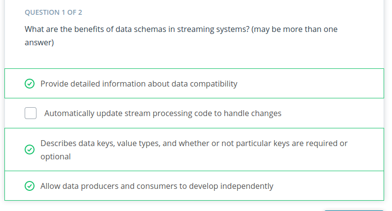

# Data Schemas and Apacho Avro


What are Data Schemas?

Data schemas help us define:
- The shape of the data
- The names of fields
- The expected types of values
- Whether certain data fields are optional or required.
Data schemas provide expectations for applications so that they can properly ingest or produce data that match that specification
Data schemas are used for communication between software
Data schemas can help us create more efficient representations with compression
Data schemas help systems develop independently of each other
Data schemas are critical in data systems and applications today
- gRPC in Kubernetes
- Apache Avro in the Hadoop Ecosystem


## Data Streamings w/o Schemas ##


```python

import asyncio
from dataclasses import dataclass, field
import json
import random

from confluent_kafka import Consumer, Producer
from confluent_kafka.admin import AdminClient, NewTopic
from faker import Faker


faker = Faker()

BROKER_URL = "PLAINTEXT://localhost:9092"


async def produce(topic_name):
    """Produces data into the Kafka Topic"""
    p = Producer({"bootstrap.servers": BROKER_URL})
    while True:
        p.produce(topic_name, ClickEvent().serialize())
        await asyncio.sleep(1.0)


async def consume(topic_name):
    """Consumes data from the Kafka Topic"""
    c = Consumer({"bootstrap.servers": BROKER_URL, "group.id": "0"})
    c.subscribe([topic_name])
    while True:
        message = c.poll(1.0)
        if message is None:
            print("no message received by consumer")
        elif message.error() is not None:
            print(f"error from consumer {message.error()}")
        else:
            #
            # TODO: Load the value as JSON and then create a ClickEvent object. The web team has
            #       told us to expect the keys "email", "uri", and "timestamp".
            #
            purchase_json = json.loads(message.value())
            try:
                print(
                    ClickEvent(
                        email=purchase_json["email"],
                        uri = purchase_json["uri"],
                        timestamp = purchase_json["timestamp"],
                    )
                )
            except KeyError as e:
                print(f"Failed to unpack message {e}")
        await asyncio.sleep(1.0)


def main():
    """Checks for topic and creates the topic if it does not exist"""
    client = AdminClient({"bootstrap.servers": BROKER_URL})

    try:
        asyncio.run(produce_consume("com.udacity.lesson3.exercise1.clicks"))
    except KeyboardInterrupt as e:
        print("shutting down")


async def produce_consume(topic_name):
    """Runs the Producer and Consumer tasks"""
    t1 = asyncio.create_task(produce(topic_name))
    t2 = asyncio.create_task(consume(topic_name))
    await t1
    await t2


@dataclass
class ClickEvent:
    email: str = field(default_factory=faker.email)
    timestamp: str = field(default_factory=faker.iso8601)
    uri: str = field(default_factory=faker.uri)

    num_calls = 0

    def serialize(self):
        email_key = "email" if ClickEvent.num_calls < 10 else "user_email"
        ClickEvent.num_calls += 1
        return json.dumps(
            {"uri": self.uri, "timestamp": self.timestamp, email_key: self.email}
        )

    @classmethod
    def deserialize(self, json_data):
        purchase_json = json.loads(json_data)
        return Purchase(
            username=purchase_json["username"],
            currency=purchase_json["currency"],
            amount=purchase_json["amount"],
        )


if __name__ == "__main__":
    main()
```





# Avro #


Binary format of Avro includes not only your application data in the schema format you define, but it also includes the schema definition itself. 

Avro Schema - Key Points

- Apache Avro records are defined in JSON.
- Avro records include a required name, such as "user"
- Avro records must include a type defined as record
- Avro records may optionally include a namespace, such as "com.udacity"
- Avro records are required to include an array of fields that define the names of the expected fields and their associated type. Such as "fields": [{"name": "age", "type": "int"}]
- Avro can support optional fields by specifying the field type as either null or some other type. Such as "fields": [{"name": "age", "type": [“null”, "int"]}]
- Avro records are made up of complex and primitive types
  - Complex types are other records, arrays, maps, and others
- Please reference the [Avro documentation](https://avro.apache.org/docs/1.8.2/spec.html#schemas)for full documentation and additional examples
- Here is what a stock ticker price change schema might look like


%% TODO: Entender porque si no ponemos namespace (o ponemos otro) en schema si se procesa <10-03-21, Samuel> %%

## Apache Avro Summary ##


In this section you learned how to use Apache Avro as a Data Schema:

- Avro has primitive types, such as int, string, and float
- Avro has complex types, such as record, map, and array
- Avro data is sent alongside the schema definition, so that downstream consumers can make use of it
- Avro is used widely in data engineering and the Kafka ecosystem

Optional Further Research into Apache Avro

- Python fastavro Library
- Apache Avro Specification


How does Shchema Registry store state?
- In a Kafka topic.


Schema Registry allows data deletion by default.
Schema Registry is part of Apache Kafka
HTTP REST is the protocol used to communicate with Schema Registry. 


## Schema Registry Summmary ##


- Provides an HTTP REST API for managing Avro schemas
- Many Kafka clients natively support Schema Registry interactions for you
- Reduces network overhead, allowing producers and consumers to register schemas one time
- Simplifies using Avro, reducing the barrier to entry for developers
- Uses a Kafka topic to store state
- Deployed as one or more web servers, with one leader
- Uses ZooKeeper to manage elections

**Schema Registry - Optional Further Research**

- confluent_kafka_python Avro and Schema Registry support: https://docs.confluent.io/current/clients/confluent-kafka-python/index.html?highlight=partition#module-confluent_kafka.avro
- Schema Registry Overview : https://docs.confluent.io/current/schema-registry/index.html
- Schema Registry HTTP API Documentation : https://docs.confluent.io/current/schema-registry/develop/api.html


# Schema Compatibility #


When you write producer code, your are responsible for telling the schema registry what kind of compatibility the change represents.
Additionally, the consumer needs to know how to fetch and handle this compatibility changes. 
4 categories of compatibility:
- Backward Compatibility
- Forward Compatibility
- Full compatibility
- None

Backward Compatibility

Deletion of a field on the new schema and the addition of an optional field on the new schema.

If the producer is making a change that is backwards compatible, we need to allow the consumers to update to the latest version of the schema before we release the updated producer.


Forward Compatibility

Before Compatible changes, you need to update producers to use the latest version of the schema, before updating the consumers. 


- Forward compatibility means that consumer code developed against the previous version of an Avro Schema can consume data using the newest version of a schema without modification
  - The deletion of an optional field or the addition of a new field are forward compatible changes
  - Producers need to be updated before consumers
- The FORWARD compatibility type indicates that data produced with the latest schema (N) is usable by consumers using the previous schema version (N-1)
- The BACKWARD_TRANSITIVE compatibility type indicates that data produced with the latest schema (N) is usable by all consumers using any previous schema version (1 → N-1)


### Quiz ###
Which is forward compatible?:
The removal of an optional field from the latest schema and the addition of a field to the latest version of a schema.
The removal of a required field from the latest schema wouldn't be forward compatible since the filed is required for previous consumers.


> Una forma de verlo puede ser que **backward compatible** es si borro algo de lo que voy a mandar, el consumidor sigue sin problemas cuando el consumidor tiene la versión anterior. (Se hace el cambio en el new schema)
> 
> Por otro lado, **forward compatible** es el cambio en el latest schema. Consumers developed against the previous schema can use the latest.


Full Compatibility

Consumers developed against the latest schema can consume data using the previous schema **(backward compatibility)**, and that consumers developed against the previous schema, can still consume data from the latest schema **(forward compatibility)**.


Full compatibility means that consumers developed against the latest schema can consume data using the previous schema, and that consumers developed against the previous schema can consume data from the latest schema as well. In other words, full compatibility means that a schema change is both forward and backward compatible.
- Changing the default value for a field is an example of a full compatible change.
- The order in which producers or consumers are updated does not matter.
The FULL compatibility type indicates that data produced is both forward and backward compatible with the current (N) and previous (N-1) schema.
The FULL_TRANSITIVE compatibility type indicates that data produced is both forward and backward compatible with the current (N) and all previous (1 → N-1) schemas.


No Compatibility (NONE Compatibility)

- No compatibility disables compatibility checking by Schema Registry.
  - In this mode, Schema Registry simply becomes a schema repository.
- Use of NONE compatibility is not recommended.
- Schemas will sometimes need to undergo a change that is neither forward nor backward compatible.
  - **Best practice is to create a new topic with the new schema and update consumers to use that new topic.**
  - Managing multiple incompatible schemas within the same topic leads to runtime errors and code that is difficult to maintain.


`None` tells schema registry to stop tracking changes, here is a best practice to create a new topic with the new schema rather than put incompatible data into the new topic.


Not using schema registry to track compatibility in a sense almost wipes out the benefit of using the tool. 


None compatibility would be if we change the type of a field.

Optional Further Research on Schema Evolution and Compatibility

- [Confluent’s Schema Evolution and Compatibility Documentation](https://docs.confluent.io/current/schema-registry/avro.html#schema-evolution-and-compatibility)
- [Avro Schema Resolution Rules for backward compatibility](http://avro.apache.org/docs/1.8.2/spec.html#Schema+Resolution)

