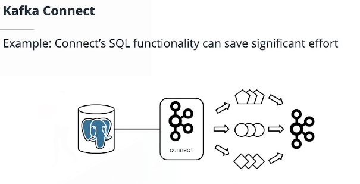
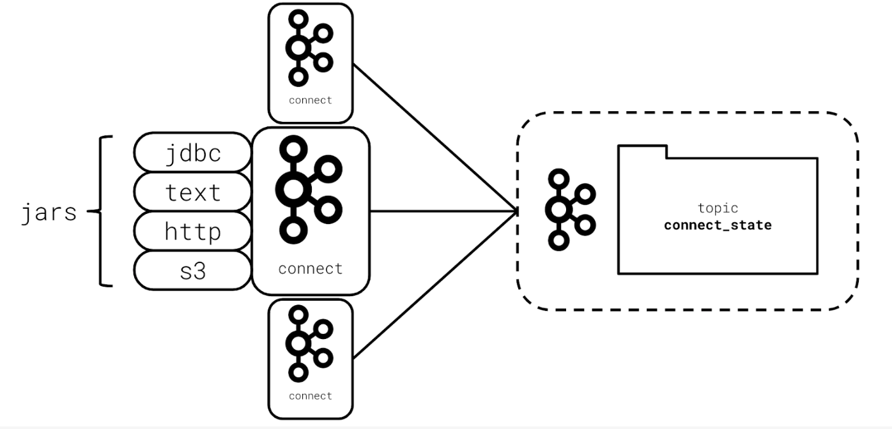
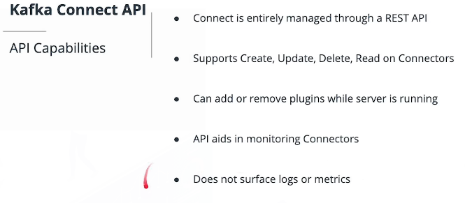
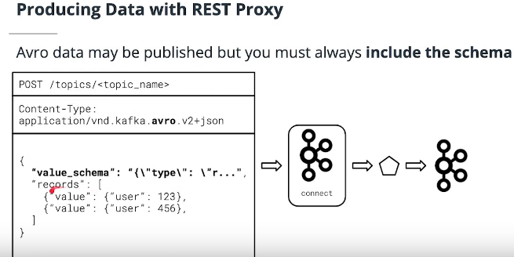
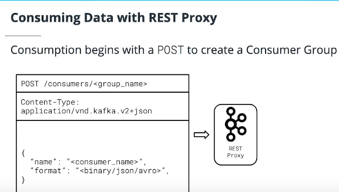

# Kafka Connect and REST Proxy #


Glossary of Key Terms You Will Learn in this Lesson
- Kafka Connect - A web server and framework for integrating Kafka with external data sources such as SQL databases, log files, and HTTP endpoints.
-    JAR - Java ARchive. Used to distribute Java code reusably in a library format under a single file.
- Connector - A JAR built on the Kafka Connect framework which integrates to an external system to either source or sink data from Kafka
- Source - A Kafka client putting data into Kafka from an external location, such as a data store
- Sink - A Kafka client removing data from Kafka into an external location, such as a data store
- JDBC - Java Database Connectivity. A Java programming abstraction over SQL database interactions.
- Task - Responsible for actually interacting with and moving data within a Kafka connector. One or more tasks make up a connector.
- Kafka REST Proxy - A web server providing APIs for producing and consuming from Kafka, as well as fetching cluster metadata.


## Kafka Connect ##




Kafka connect:
- Saves time
- Allows users to repeatedly implement similar Kafka integrations
- Provides an abstraction from Kafka for application code
- Dereases amount of code to mantain

Kafka connect is just a web server, 




At a high level, every kafka connect plugin defines a few things:
- **Conectors** are abstractions for managing tasks.
- **Tasks** contain the production or consumption code.
- Kafka and target systems often have different formats. 
- **Converters** map data formats to and from Connect. The data in a cassandra table or in a json file in an S3 bucket may not be appropiated formatted for the destination kafka topic.


The **Kafka Connect architechture** is one o more JAva web servers using plugni JARs to bridge Kafka and other external data systems.

*Connectors* are not built into the web server directly because the plugin architechture allows developers to create funcionality that the original designers may not have imagined.


Optional Further Reading on Kafka Connect
- [Overview of Kafka Connect](https://docs.confluent.io/current/connect/concepts.html) 


Kafka Connect Connector Plugins

Here are some popular Kafka Connect plugins:

- Confluent Kafka Connect Plugin Search
- Amazon S3 Connector
- SQL JDBC Connector
- HDFS Connector
- HTTP Connector


**Scenarios** where you would NOT want to user Kafka Connect.
- The data needs to be transformed before being stored in Kafka.
- the data must be sent as it occurs rather than being sent preiodically by Kafka Connect.

Kafka Connect is managed through and http rest api. 




The bad thing is that it does not surface logs or metrics. 


## Usage of Kakfa Connect API ##


Documentation: [Connect Rest Interface](https://docs.confluent.io/platform/current/connect/references/restapi.html)


`curl http://localhost:8083/connector-plugins | python -m json.tool`
```
curl -X POST -H 'Content-Type: application/json' -d '{
    "name": "first-connector",
    "config": {
        "connector.class": "FileStreamSource",
        "tasks.max": 1,
        "file": "/var/log/journal/confluent-kafka-connect.service.log",
        "topic": "kafka-connect-logs"
    }
  }' \
  http://localhost:8083/connectors
```


List Connectors
`curl http://localhost:8083/connectors | python -m json.tool`

Detailing Connectors
`curl http://localhost:8083/connectors/first-connector | python -m json.tool`

Pausing Connectors
`curl -X PUT http://localhost:8083/connectors/first-connector/pause`

Restart:
`curl -X POST http://localhost:8083/connectors/first-connector/restart`

Deleting:
`curl -X DELETE http://localhost:8083/connectors/first-connector`


To see the STATUS:
curl http://localhost:8083/connectors/connector/status | python -m json.tool


Kafka Connect Connectors - Optional Further Research

- [Confluent Connector Hub](https://www.confluent.io/hub/?_ga=2.42557541.1345547963.1563205519-78292278.1561645529)
- [List of core Connectors included with most distributions](https://docs.confluent.io/current/connect/managing/connectors.html)
- [Connect REST API Documentation](https://docs.confluent.io/current/connect/references/restapi.html)


## Key Kafka Connectors ##

Demo: Creating a Kafka Connect FileStream Source


```python

# Please complete the TODO items in this code

import asyncio
import json

import requests

KAFKA_CONNECT_URL = "http://localhost:8083/connectors"
CONNECTOR_NAME = "exercise2"


def configure_connector():
    """Calls Kafka Connect to create the Connector"""
    print("creating or updating kafka connect connector...")

    rest_method = requests.post
    resp = requests.get(f"{KAFKA_CONNECT_URL}/{CONNECTOR_NAME}")
    if resp.status_code == 200:
        return

    #
    # TODO: Complete the Kafka Connect Config below.
    #       See: https://docs.confluent.io/current/connect/references/restapi.html
    #       See: https://docs.confluent.io/current/connect/filestream_connector.html#filesource-connector
    #
    resp = rest_method(
        KAFKA_CONNECT_URL,
        headers={"Content-Type": "application/json"},
        data=json.dumps(
            {
                "name": CONNECTOR_NAME,  # TODO
                "config": {
                    "connector.class": "FileStreamSource",  # TODO
                    "topic": "lesson.sample.logs",  # TODO
                    "tasks.max": 1,  # TODO
                    "file": f"/tmp/{CONNECTOR_NAME}.log",
                    "key.converter": "org.apache.kafka.connect.json.JsonConverter",
                    "key.converter.schemas.enable": "false",
                    "value.converter": "org.apache.kafka.connect.json.JsonConverter",
                    "value.converter.schemas.enable": "false",
                },
            }
        ),
    )

    # Ensure a healthy response was given
    resp.raise_for_status()
    print("connector created successfully")


async def log():
    """Continually appends to the end of a file"""
    with open(f"/tmp/{CONNECTOR_NAME}.log", "w") as f:
        iteration = 0
        while True:
            f.write(f"log number {iteration}\n")
            ####################################
            # FLUSH IS WHAT MAKES A PRODUCER SYNCHRONOUS
            ####################################
            f.flush()
            await asyncio.sleep(1.0)
            iteration += 1


async def log_task():
    """Runs the log task"""
    task = asyncio.create_task(log())
    configure_connector()
    await task


def run():
    """Runs the simulation"""
    try:
        asyncio.run(log_task())
    except KeyboardInterrupt as e:
        print("shutting down")


if __name__ == "__main__":
    run()
```

## JDBC Sinks and Sources ##

A **Source** integration is one in which kafka connect is pulling data from a data source, into kafka. A **Sink** integration is one in which is taking data from Kafka and place it into another data source.


Another common use case of a JDBC connector is to save the resulting events from a stream processing applicatoin into a database for long-term storage. This is what we refer to as JDBC connector sink.


Kafka Connect Troubleshooting Tips

As demonstrated in the demo video above, if you run into trouble with Kafka Connect in the workspace exercise below, or during your project, here are some tips to help your debugging:

- First, use the REST API to check the connector status. curl `http:<connect_url>/connectors/<your_connector>/status` to see what the status of your connector is
- Next, use the REST API to check the task status for the connector. `curl http:<connect_url>/connectors/<your_connector>/tasks/<task_id>/status` to see what the status of your task is

If you can’t deduce the failure from these two options, the next best bet is to examine the logs of Kafka Connect. Typically, a tool like `tail` or `less` is useful in examining the logs for Kafka Connect. On Linux systems, Kafka Connect logs are often available in `/var/log/kafka/`. Kafka Connect is often verbose and will indicate what the issue is that it is experiencing.

If you are familiar with Java Management Extensions (JMX) and have access to the server, you may also opt to inspect its JMX metrics for information on failures. However, JMX is most useful for automated monitoring, so you likely will not receive any additional insights from using JMX vs the API or the logs.


```python
# Please complete the TODO items in this code

import asyncio
import json

import requests


KAFKA_CONNECT_URL = "http://localhost:8083/connectors"
CONNECTOR_NAME = "sample"

def configure_connector():
    """Calls Kafka Connect to create the Connector"""
    print("creating or updating kafka connect connector...")

    rest_method = requests.post
    resp = requests.get(f"{KAFKA_CONNECT_URL}/{CONNECTOR_NAME}")
    if resp.status_code == 200:
        return

    #
    # TODO: Complete the Kafka Connect Config below for a JDBC source connector.
    #       You should whitelist the `clicks` table, use incrementing mode and the
    #       incrementing column name should be id.
    #
    #       See: https://docs.confluent.io/current/connect/references/restapi.html
    #       See: https://docs.confluent.io/current/connect/kafka-connect-jdbc/source-connector/source_config_options.html
    #
    resp = rest_method(
        KAFKA_CONNECT_URL,
        headers={"Content-Type": "application/json"},
        data=json.dumps(
            {
                "name": "clicks-jdbc",  # TODO
                "config": {
                    "connector.class": "io.confluent.connect.jdbc.JdbcSourceConnector",  # TODO
                    "topic.prefix": "connector-",  # TODO
                    "mode": "incrementing",  # TODO
                    "incrementing.column.name": "id",  # TODO
                    "table.whitelist": "clicks",  # TODO
                    "tasks.max": 1,
                    "connection.url": "jdbc:postgresql://localhost:5432/classroom",
                    "connection.user": "root",
                    "key.converter": "org.apache.kafka.connect.json.JsonConverter",
                    "key.converter.schemas.enable": "false",
                    "value.converter": "org.apache.kafka.connect.json.JsonConverter",
                    "value.converter.schemas.enable": "false",
                },
            }
        ),
    )

    # Ensure a healthy response was given
    try:
        resp.raise_for_status()
    except:
        print(f"failed creating connector: {json.dumps(resp.json(), indent=2)}")
        exit(1)
    print("connector created successfully.")
    print("Use kafka-console-consumer and kafka-topics to see data!")


if __name__ == "__main__":
    configure_connector()
```


List connectors:
curl http:localhost:8083/connectors | python -m json.tool

We need to check the status of our connector:
curl http:localhost:8083/connectors/clicks-jdbc/status | python -m json.tool


Debugging Purposes:
tail -f /var/log/journal/confluent-kafka-connect.service.log

List Topics
kafka-topics --list --zookeeper localhost:2181


Reads the data
Kafka-console-consumer --bootstrap-server localhost:9092 --topic connector-clicks --from-beginning


Kafka Key Connectors - Summary

In this section you learned how to:

- Apply the Kafka Connect FileStream Source connector to push logs into Kafka
- Apply the Kafka Connect JDBC Source connector to push SQL data into Kafka

Kafka Key Connectors - Optional Further Research
- [Kafka FileStream Connector Documentation](https://docs.confluent.io/current/connect/filestream_connector.html)
- [Kafka JDBC Source Connector Documentation](https://docs.confluent.io/current/connect/kafka-connect-jdbc/index.html)


## Kafka REST Proxy ##


At it's core, all REST proxy does, is to transform structured json data from you application, into kafka binary data format. Conversevly, it can translate binary kafka data for a json payload. 

You cannot create topics by a rest proxy.


It's most useful when you really can't use a client library.

REST Proxy support the following:
- Fetch administrative and metadata information
- Consumer from topics
- Produce data to an existing topic


You would **not** want to use REST Proxy when:
- You want to put logs into Kafka from a server without a Kafka Integration. (Here Kafka connect could help).
- When writing a Python application that can be updated to use new dependencies
- When writing a Java application that can be updated to use new dependencies.

The following are scenarios where you could want to user REST proxy:
- When working on a frontend client without a native Kafka library.
- When working on a legacy applciation that supports HTTP but can't add new dependencies.
- For reading administrative and metadata information about the cluster.


```python
import json
import requests


REST_PROXY_URL = "http://localhost:8082"


def get_topics():
    """Gets topics from REST Proxy"""
    # TODO: See: https://docs.confluent.io/current/kafka-rest/api.html#get--topics
    resp = requests.get(f"{REST_PROXY_URL}/topics")  # TODO

    try:
        resp.raise_for_status()
    except:
        print("Failed to get topics {json.dumps(resp.json(), indent=2)})")
        exit()

    print("Fetched topics from Kafka:")
    print(json.dumps(resp.json(), indent=2))
    return resp.json()


def get_topic(topic_name):
    """Get specific details on a topic"""
    # TODO: See: https://docs.confluent.io/current/kafka-rest/api.html#get--topics
    resp = requests.get(f"{REST_PROXY_URL}/topics/{topic_name}")  # TODO

    try:
        resp.raise_for_status()
    except:
        print("Failed to get topics {json.dumps(resp.json(), indent=2)})")
        exit(1)

    print("Fetched topics from Kafka:")
    print(json.dumps(resp.json(), indent=2))


def get_brokers():
    """Gets broker information"""
    # TODO See: https://docs.confluent.io/current/kafka-rest/api.html#get--brokers
    resp = requests.get(f"{REST_PROXY_URL}/brokers")  # TODO

    try:
        resp.raise_for_status()
    except:
        print("Failed to get brokers {json.dumps(resp.json(), indent=2)})")
        exit(1)

    print("Fetched brokers from Kafka:")
    print(json.dumps(resp.json(), indent=2))


def get_partitions(topic_name):
    """Prints partition information for a topic"""
    # TODO: Using the above endpoints as an example, list
    #       partitions for a given topic name using the API
    #
    #       See: https://docs.confluent.io/current/kafka-rest/api.html#get--topics-(string-topic_name)-partitions
    resp = requests.get(f"{REST_PROXY_URL}/topics/{topic_name}/partitions")
    try:
        resp.raise_for_status()
    except:
        print("Failed to get partitions")
        exit(1)
    print("Fetched partitions from Kafka:")
    print(json.dumps(resp.json(), indent=2))


if __name__ == "__main__":
    topics = get_topics()
    get_topic(topics[0])
    get_brokers()
    get_partitions(topics[-1])
```

Summary - Kafka REST Proxy

In this section we learned that Kafka REST Proxy:

    Is a web server built in Java and Scala that allows any client capable of HTTP to integrate with Kafka
    Allows production and consumption of Kafka data
    Allows read-only operations on administrative information and metadata


**REST Proxy Producer**

- [POST data to /topics/<topic_name> to produce data)](https://docs.confluent.io/current/kafka-rest/api.html#post--topics-(string-topic_name)
- The Kafka data may be POSTed in Binary, JSON, or Avro
- When sending Avro data you must always include the schema data as a string
- [Always check your Content-Type header to ensure that it is correctly configured](https://docs.confluent.io/current/kafka-rest/api.html#content-types)
  - Content-Type is in the format `application/vnd.kafka[.embedded_format].[api_version]+[serialization_format]`
  - `embedded_format` is how the data destined for Kafka is formatted. Must be one of `binary`, `json`, or `avro`
  - `api_version` is the API version for REST Proxy -- this should always be `v2` as of this writing
    - `serialization_format` has nothing to do with your Kafka data, this is how the actual data being sent to REST proxy is serialized. Only json is supported for now -- so always set this to `json`!
- When using REST Proxy, always start by ensuring that the `Content-Type` is correctly set before running your code. A misconfigured `Content-Type` can lead to confusing and hard-to-debug errors.


To Produce to a Kafka Topic, you need to use `POST`.

REST Proxy allows you to post a list of data to a topic at once so you can send more than 1 message at a time. 



Pay attention into Content-Type: application/vnd.kafka.avro.v2+jason. We need to use the correct Content-Type.

- application/vnd.kafka.binary.v2+json
- application/vnd.kafka.json.v2+json
- application/vnd.kafka.avro.v2+json

We specify the avro schema in `value_schema`. The value is a json string, not raw json. 


One of the drawbacks of using the REST proxy, is that we need to send, in every messge, the value schema. 


**The following are valid Content-Type headers**

- application/vnd.kafka.avro.v2+json
- application/vnd.kafka.json.v2+json
- application/vnd.kafka.binary.v2+json

### Produce Data to Kafka Rest Proxy ###


```python
from dataclasses import asdict, dataclass, field
import json
import time
import random

import requests
from confluent_kafka import avro, Consumer, Producer
from confluent_kafka.avro import AvroConsumer, AvroProducer, CachedSchemaRegistryClient
from faker import Faker


faker = Faker()
REST_PROXY_URL = "http://localhost:8082"


def produce():
    """Produces data using REST Proxy"""

    # TODO: Set the appropriate headers
    #       See: https://docs.confluent.io/current/kafka-rest/api.html#content-types
    headers = {
        "Content-Type": "application/vnd.kafka.json.v2+json"
    }
    # TODO: Define the JSON Payload to b sent to REST Proxy
    #       To create data, use `asdict(ClickEvent())`
    #       See: https://docs.confluent.io/current/kafka-rest/api.html#post--topics-(string-topic_name)
    data = {
        "records": [
            {"value": asdict(ClickEvent())}
        ]
    }
    # TODO: What URL should be used?
    #       See: https://docs.confluent.io/current/kafka-rest/api.html#post--topics-(string-topic_name)
    resp = requests.post(
        f"{REST_PROXY_URL}/topics/lesson4.sample5", data=json.dumps(data), headers=headers # TODO
    )

    try:
        resp.raise_for_status()
    except:
        print(f"Failed to send data to REST Proxy {json.dumps(resp.json(), indent=2)}")

    print(f"Sent data to REST Proxy {json.dumps(resp.json(), indent=2)}")


@dataclass
class ClickEvent:
    email: str = field(default_factory=faker.email)
    timestamp: str = field(default_factory=faker.iso8601)
    uri: str = field(default_factory=faker.uri)
    number: int = field(default_factory=lambda: random.randint(0, 999))


def main():
    """Runs the simulation against REST Proxy"""
    try:
        while True:
            produce()
            time.sleep(0.5)
    except KeyboardInterrupt as e:
        print("shutting down")


if __name__ == "__main__":
    main()
```


In case we want to Produce Avro Data via REST Proxy:
```
headers = {"content-type": "application/vnd.kafka.avro.v2+json"}

data = {
    "value_schema": AVRO_SCHEMA,
    "records": [
        {"value": asdict(ClickEvent())}
    ]

```


The console command to consume the data:
`kafka-consumer --bootstrap-server localhost:9092 --topic "lesson4.exercise6.click_events" --from-beginning


### Consuming Data with REST Proxy ###

To consume data from a REST proxy, you must first POST to create a named Consumer Group. 





The response will be:
```
  {
    "instance_id": "<consumer_name>",
    "base_uri": "http://<rest_uri>"
  }
```


Using the base **uri**, now you need to POST another request to the subscribe endpoint. 

The response will be: `HTTP 1.1 204 No Content`: The Response you receive is a 204 with No Content. This tells us that we succesfully subscribed.  


REST Proxy Consumer


- [POST to /consumers/<group_name> to create a consumer group)](https://docs.confluent.io/current/kafka-rest/api.html#post--consumers-(string-group_name)
- [POST to /consumers/<group_name>/instances/<instance_id>/subscriptions to create a subscription-instances-(string-instance)-subscription)](https://docs.confluent.io/current/kafka-rest/api.html#post--consumers-(string-group_name)
- [GET from /consumers/<group_name>/instances/<instance_id>/records to retrieve records-instances-(string-instance)-records)](https://docs.confluent.io/current/kafka-rest/api.html#get--consumers-(string-group_name)
  - [Always check your Accept header to ensure that it is correctly configured](https://docs.confluent.io/current/kafka-rest/api.html#content-types)
    - Content-Type is in the format application/vnd.kafka[.embedded_format].[api_version]+[serialization_format]
    - embedded_format is how the data requested from Kafka is formatted. Must be one of binary, json, or avro
    - api_version is the API version for REST Proxy -- this should always be v2 as of writing
    - serialization_format has nothing to do with your Kafka data, this is how the actual data being received from REST proxy is serialized. Only json is supported for now -- so always set this to json!
- [DELETE to /consumers/<group_name>/instances/<instance_id>/subscriptions to unsubscribe a coinsumer-instances-(string-instance)-subscription)](https://docs.confluent.io/current/kafka-rest/api.html#delete--consumers-(string-group_name)

1. By specifying the `max_byes` setting on the `GET` request, REST Proxy clients specify how much data to fetch.
2. REST Proxy clients can choose offsets. 
3. REST Proxy clients need to unsubscribe from topics. 

Example of Consuming Data with REST Proxy:


```python
import asyncio
from dataclasses import asdict, dataclass, field
import json
import time
import random

import requests
from confluent_kafka import avro, Consumer, Producer
from confluent_kafka.avro import AvroConsumer, AvroProducer, CachedSchemaRegistryClient
from faker import Faker


faker = Faker()
REST_PROXY_URL = "http://localhost:8082"
TOPIC_NAME = "lesson4.solution7.click_events"
CONSUMER_GROUP = f"solution7-consumer-group-{random.randint(0,10000)}"


async def consume():
    """Consumes from REST Proxy"""
    # TODO: Define a consumer name
    consumer_name = "solution7-consumer"
    # TODO: Define the appropriate headers
    #       See: https://docs.confluent.io/current/kafka-rest/api.html#content-types
    headers = {"Content-Type": "application/vnd.kafka.json.v2+json"}
    # TODO: Define the consumer group creation payload
    #       See: https://docs.confluent.io/current/kafka-rest/api.html#post--consumers-(string-group_name)
    data = {"name": consumer_name, "format": "avro"}
    # TODO: POST to the appropiate endpoint to create a consumer group
    #       See: https://docs.confluent.io/current/kafka-rest/api.html#post--consumers-(string-group_name)
    resp = requests.post(
        f"{REST_PROXY_URL}/consumers/{CONSUMER_GROUP}",
        data=json.dumps(data),
        headers=headers,
    )
    try:
        resp.raise_for_status()
    except:
        print(
            f"Failed to create REST proxy consumer: {json.dumps(resp.json(), indent=2)}"
        )
        return
    print("REST Proxy consumer group created")

    resp_data = resp.json()
    #
    # TODO: Create the subscription payload
    #       See: https://docs.confluent.io/current/kafka-rest/api.html#consumers
    #
    data = {"topics": [TOPIC_NAME]}
    #
    # TODO: POST the subscription payload
    #       See: https://docs.confluent.io/current/kafka-rest/api.html#consumers
    #
    resp = requests.post(
        f"{resp_data['base_uri']}/subscription", data=json.dumps(data), headers=headers
    )
    try:
        resp.raise_for_status()
    except:
        print(
            f"Failed to subscribe REST proxy consumer: {json.dumps(resp.json(), indent=2)}"
        )
        return
    print("REST Proxy consumer subscription created")
    while True:
        #
        # TODO: Set the Accept header to the same data type as the consumer was created with
        #       See: https://docs.confluent.io/current/kafka-rest/api.html#get--consumers-(string-group_name)-instances-(string-instance)-records
        #
        headers = {"Accept": "application/vnd.kafka.avro.v2+json"}
        #
        # TODO: Begin fetching records
        #       See: https://docs.confluent.io/current/kafka-rest/api.html#get--consumers-(string-group_name)-instances-(string-instance)-records
        #
        resp = requests.get(f"{resp_data['base_uri']}/records", headers=headers)
        try:
            resp.raise_for_status()
        except:
            print(
                f"Failed to fetch records with REST proxy consumer: {json.dumps(resp.json(), indent=2)}"
            )
            return
        print("Consumed records via REST Proxy:")
        print(f"{json.dumps(resp.json())}")
        await asyncio.sleep(0.1)


@dataclass
class ClickEvent:
    email: str = field(default_factory=faker.email)
    timestamp: str = field(default_factory=faker.iso8601)
    uri: str = field(default_factory=faker.uri)
    number: int = field(default_factory=lambda: random.randint(0, 999))

    schema = avro.loads(
        """{
        "type": "record",
        "name": "click_event",
        "namespace": "com.udacity.lesson3.exercise2",
        "fields": [
            {"name": "email", "type": "string"},
            {"name": "timestamp", "type": "string"},
            {"name": "uri", "type": "string"},
            {"name": "number", "type": "int"}
        ]
    }"""
    )


async def produce(topic_name):
    """Produces data into the Kafka Topic"""
    p = AvroProducer(
        {
            "bootstrap.servers": "PLAINTEXT://localhost:9092",
            "schema.registry.url": "http://localhost:8081",
        }
    )
    try:
        while True:
            p.produce(
                topic=topic_name,
                value=asdict(ClickEvent()),
                value_schema=ClickEvent.schema,
            )
            await asyncio.sleep(0.1)
    except:
        raise


async def produce_consume(topic_name):
    """Runs the Producer tasks"""
    t1 = asyncio.create_task(produce(topic_name))
    t2 = asyncio.create_task(consume())
    await t1
    await t2


def main():
    """Runs the simulation against REST Proxy"""
    try:
        asyncio.run(produce_consume(TOPIC_NAME))
    except KeyboardInterrupt as e:
        print("shutting down")


if __name__ == "__main__":
    main()
```


