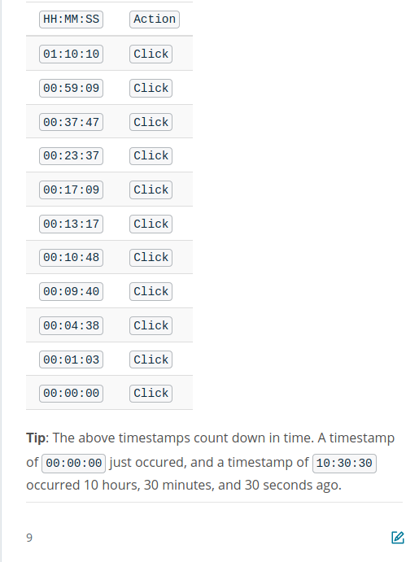

# kSQL

## Lesson Overview ##


KSQL is a SQL-like abstraction developed by Confluent, which provides users the ability to create streams and tables. Students will see how to write simple SQL queries to turn their Kafka topics into KSQL streams and tables, and then write those tables back out to Kafka. This section will focus on instructing students on the syntax of KSQL, as well as developing an understanding of how keys, joins, tables, streams, as well as storage works. Students will also learn how to leverage windowing in KSQL.

In this lesson we will learn:

- What KSQL is and how it is architected
- Why you would choose KSQL vs. an application framework like Faust
- How to turn Kafka Topics into KSQL Tables
- How to turn Kafka Topics into KSQL Streams
- How we can query KSQL
- How we can window in KSQL
- How to aggregate data in KSQL
- How to join data in KSQL


## KSQL Architechture ##


KSQL is built on which stream processing framework?
- Kafka Streams. 
How do you interact with KSQL?
- CLI
- HTTP REST API
- Predefined SQL File


ksql cli is in developemnt, but in production we should use predefeined SQL files. 

## KSQL vs Traditional Frameworks ##

Pros
- Simpler to write SQL than to build entire custom app.
- Great for exploration when exact solution not known.
- No need for specific programming language skills. 
- Comes with loggings and metrics out of the box. 
- Simpler to deploy KSQL o a server than deploying an entire application.
Cons
- Not always easy to use SQL to solve all problems. 
- Can't import whatever library you want (like with faust that you can import any python library); You are limited to what ksql provides you. Supports udfs. 
- You can define your own user defined functions but you need to do it in java. 
  
  
### Creating a stream

- Creating Streams from an underlying topic requires you to specify column names and their types
- You must also specify the serialization format as one of JSON, AVRO, or DELIMITED (csv)
- You must also specify the underlying topic name
- You may create a stream from another existing stream with CREATE STREAM <stream_name> AS SELECT …
- KSQL Create Stream Documentation : https://docs.confluent.io/current/ksql/docs/developer-guide/syntax-reference.html#create-stream
- KSQL Create Stream from SELECT documentation : https://docs.confluent.io/current/ksql/docs/developer-guide/syntax-reference.html#create-stream-as-select


```sql
CREATE STREAM purchases (
  username VARCHAR,
  currency VARCHAR,
  amount INT
) WITH (
  KAFKA_TOPIC="purchases",
  VALUE_FORMAT="JSON"
)
  

CREATE STREAM purchases_high_value AS
  SELECT *
  FROM purchases
  WHERE amount > 10000;
 ``` 
 
  
First, POPULAR_URIS topic has been created and is still present. By default, this is how KSQL behaves. If you'd like to clean up the topic you need to do it manually. Second, why was a POPULAR_URIS topic created, but not one for the stream CLICKEVENTS? 
POPULAR_URIS actually required modification to the data, so, an intermediate topic was created. CLICKEVENTS, however, required no modification, so the underlying topic is used as-is.


## Creating a Table ##


- Creating Tables from an underlying topic requires you to specify column names and their types
  - You must also specify the serialization format as one of JSON, AVRO, or DELIMITED (csv)
  - You must also specify the underlying topic name
  - You may create a table from another existing stream or table with CREATE STREAM <stream_name> AS SELECT …
  - KSQL Key Requirements Documentation
  - KSQL Create Table Documentation
  - KSQL Create Table from SELECT documentation

  
  
  

### Querying ###


If we have a query:


```sql
SELECT username FROM purchases WHERE currency="USD" AND amount > 100000
```

if we exit (CTRL + C) and exit this query while is running, the data is going to be lost forever. With `kSQL` if you want your streaming query to keep running and to be able to use that data, you need to create the query with:

```sql
CREATE STREAM <stream_name> AS SELECT

or 

CREATE TABLE <table_name> AS SELECT
```

So if we create the query with SELECT, it just will print out the result to my `kSQL CLI`. 


Querying Syntax

- SELECT statements may be run in KSQL CLI, but as soon as the session is terminated, so too is the data calculation.
- Use CREATE STREAM <stream_name> AS SELECT… and CREATE TABLE <table_name> AS SELECT … to persist your queries for long-term usage
- [KSQL Querying Syntax Documentation](https://docs.confluent.io/current/ksql/docs/developer-guide/syntax-reference.html#select)
- [See the KSQL documentation for a list of all Scalar functions supported for querying](https://docs.confluent.io/current/ksql/docs/developer-guide/syntax-reference.html#scalar-functions)

But, the SELECT type of query is sometimes useful for exploration. 


## Hopping and Tumbling Windows ##


- KSQL supports Tumbling windows with the WINDOW TUMBLING (SIZE <duration>) syntax : https://docs.confluent.io/current/ksql/docs/developer-guide/aggregate-streaming-data.html#aggregate-records-over-a-tumbling-window
- KSQL supports Hopping windows with the WINDOW HOPPING (SIZE <duration>, ADVANCE BY <interval>) syntax : https://docs.confluent.io/current/ksql/docs/developer-guide/aggregate-streaming-data.html#aggregate-records-over-a-hopping-window

How might you approximate a Sliding Window in KSQL?
- Use a Hopping Window with a short `ADVANCE` period.


## Session Windowing ##


- Keeps track of differences between the time a key was last seen and the current key arrival time.
- If the difference between the time a key was last seen and the current key arrival time, for two records with the same key, is larger than the session window length defined, a new window is started.
- If the difference between the time a key was last seen and the current key arrival time, for two records with the same key, is less than the session window length, the record is added to the current window, and the session expiration time is started anew.

  - Session expiration denotes that the full session period begins again

Session windows is usefull for analyzing and understanding engangement user activity in your website. 


How many events in a Session Window?

If we used a session window of 15 minutes and the following actions occurred, how many events would have occurred in the most recent window? 




```sql
# We need to first create the STREAM;
CREATE STREAM clickevents
  (email VARCHAR,
   timestamp VARCHAR,
   uri VARCHAR,
   number INTEGER)
  WITH (KAFKA_TOPIC='com.udacity.streams.clickevents',
        VALUE_FORMAT='JSON');

        


# Hopping Window

        
# Session Window

CREATE STREAM clickevents
  (email VARCHAR,
   timestamp VARCHAR,
   uri VARCHAR,
   number INTEGER)
  WITH (KAFKA_TOPIC='com.udacity.streams.clickevents',
        VALUE_FORMAT='JSON');


# Then we can select the data:
SELECT uri FROM CLICKEVENTS_SESSION LIMIT 5;

```


### Aggregating Data ###


Group By are another usefull form of data aggregation. Output of a group by in ksql is always a table. 


KSQL Aggregations

- Use GROUP BY to create aggregations in KSQL
- GROUP BY always creates a KSQL Table
- KSQL supports aggregations like COUNT, MAX, MIN, SUM, TOPK, HISTOGRAM and more

Example
```sql
SELECT currency, TOPK(amount, 10)
FROM purchase
WINDOW TUMBLING (SIZE 1 HOURS)
GROUP BY currency;


SELECT uri, SUM(number)
FROM clickevents
GROUP BY uri;


SELECT uri,
  SUM(number) AS total_number,
  HISTOGRAM(uri) AS num_uri
FROM clickevents
GROUP BY uri;


SELECT uri , TOPK(number, 5)
FROM clickevents
WINDOW TUMBLING (SIZE 30 SECONDS)
GROUP BY uri;
```


### Joins ###

- KSQL supports Stream to Stream, Stream to Table, and Table to Table JOINs
- Limitations on the kind of JOINs supported exist for each of the types of JOINs
- Stream to Stream JOINs may be windowed
- JOINed entities must be co-partitioned
- JOINed data must share the same KEY in KSQL as used for the Kafka record


If the streams that are being join are not co-partitioned, meaning they not shared the same key, you can't joing the streams. 
The key that we choose in `ksql` must also match the key for our messages in the kafka topic. 

We just need to repartition our data so that the join is possible. 

To repartition one or more streams for a join, you can use `groupby` to create an intermidiate stream so it's appropiatledly copartitioned for the join. 


You can join:
- Table to table.
- Stream to stream.
- Stream to table. 
  
You cannot join table to streams. You cannnot also perform an outer join on streams to tables. You can only perform left or inner joins. 


The `key` determines if the entities we wish to join are co-partitioned.

The `key`used in ksql and the kafka message must match.


The following are true about JOINs and Windows:
- Stream to Stream JOINs are supported. 
- Stream to TAble JOINs are supported in ksq, but not in windowing.
- JOINs do support windowing.


```sql
CREATE STREAM clickevent_pages AS
  SELECT ce.uri, ce.email, ce.timestamp, ce.number, p.description, p.created
  FROM clickevents ce
  JOIN pages p on ce.uri = p.uri;
  
  
  
CREATE STREAM clickevent_pages_inner AS
  SELECT ce.uri, ce.email, ce.timestamp, ce.number, p.description, p.created
  FROM clickevents ce
  INNER JOIN pages p on ce.uri = p.uri;

  
# This will fail to run:
# ksql only supports full outer join when joining a
# Table to a Table or a Stream to a Stream
CREATE STREAM clickevent_pages_outer AS
  SELECT ce.uri, ce.email, ce.timestamp, ce.number, p.description, p.created
  FROM clickevents ce
  FULL OUTER JOIN pages p on ce.uri = p.uri;
```


