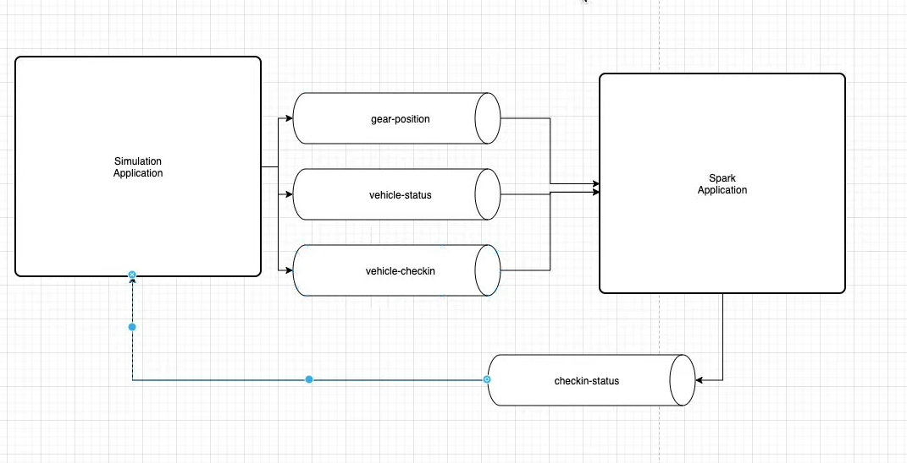

# Joins and JSON #




**What is StructType?**

**StructType**: a Spark class that defines the schema for a DataFrame

StructType Code

# JSON Sample: {"firstName":"Muhamed","lastName":"Adel"}
```python
personSchema = StructType (
  [
    StructField("firstName",StringType()),
    StructField("age",IntegerType())
  ]
)
```

StructType Important Points

- Using an array of StructFields, you create your StructType
- Each StructField correlates with a JSON field

What is a StructField?

`StructField`: a Python class used to create a typed field in a StructType.

Example: `StructField("truckNumber", StringType())`

`StructField` Code

```python
# JSON Sample: {"firstName":"Aarthi","lastName":"Singh"}

StructField("firstName", StringType())
StructField("age", IntegerType())
```


**Creating a StructType Schema in Action**


```python
# Sample JSON: 
# {
#    "truckNumber":"2352523",
#    "destination":"Accra",
#    "milesFromShop":100,
#    "odometerReading": 99789
# }

truckStatusSchema = StructType (   
        [
          StructField("truckNumber", StringType()),        
          StructField("destination", StringType()), 
          StructField("milesFromShop", IntegerType()),  
          StructField("odometerReading", IntegerType())
        ]
)   


vehicleStatusStreamingDF \
  .withColumn("value",from_json("value",truckStatusSchema))  
```


**How to call `.withColumn`**
```python
vehicleStatusStreamingDF \
  .withColumn("newFieldName", "data Value")
```


## Joining DataFrames ##


Using a Column Alias in Spark SQL

Using "select columnName as columnNameAlias" can be useful when joining two DataFrames. Usually they will both share at least one column. If you don't use aliases, you may run into errors when trying to join them together.

Example:

`flightInfoDF=spark.sql("select flightNumber as flightInfoFlightNumber from FlightInfoView")`


**What does calling .join do?**

**join**: A function called on a DataFrame that accepts the right hand of the join (another Dataframe), and the join expression (includes the fields to join on). This is the Spark function that implements the concept of joining two different groups of data.

Example: 

```python
checkinStatusDF = vehicleStatusSelectStarDF \
.join(vehicleCheckinSelectStarDF, expr("""
    statusTruckNumber = checkinTruckNumber
"""                                                                                 
))
```

Calling .join Key Points

- You will need two DataFrames defined already
- You will want to avoid using the same column names in each DataFrame to avoid collisions
- Using field aliases in each DataFrame where needed (ex: "truckNumber as statusTruckNumber")
- The default join type is a left outer join

Additional Resources

For more reading on joining Spark Streams, check out the [Join Section in the Official Spark Streaming Guide](https://spark.apache.org/docs/latest/structured-streaming-programming-guide.html#join-operations)


## Sink to Kafka ##

- In order to sink to Kafka, you need to have something to sink
- That will be a Streaming DataFrame you create
- When we sink to Kafka we need to identify the topic we will be sending data to
- Then it is just a matter of writing a few lines to sink your DataFrame
- They will look similar to what you have done to sink to the console


```python
 vehicleStatusDF\
 .selectExpr("cast(statusTruckNumber as string) as key", "to_json(struct(*)) as value") \
    .writeStream \
    .format("kafka") \
    .option("kafka.bootstrap.servers", "localhost:9092")\
    .option("topic", "vehicle-status-changes")\
    .option("checkpointLocation","/tmp/kafkacheckpoint")\
    .start()\
    .awaitTermination()
```

**How to call to_json**
- `to_json(struct(*)) as value)

The important points are that we pass the fields you want to serailize using the struct() function.
In this case, we are using * for all fields
Use field aliasing to set the field name

The option **checkpointLocation** needs to be a writable path on a spark worker and it's used by spark to offload some data to disk for recovery.

Example code:
```python
 vehicleStatusDF\
 .selectExpr("cast(statusTruckNumber as string) as key", "to_json(struct(*)) as value") \
    .writeStream \
    .format("kafka") \
    .option("kafka.bootstrap.servers", "localhost:9092")\
    .option("topic", "vehicle-status-changes")\
    .option("checkpointLocation","/tmp/kafkacheckpoint")\
    .start()\
    .awaitTermination()
```


**For TroubleShooting**


If you had a Spark application that wasn't outputting any data, with the last few lines below, what small code change could you make?:

```python
customerSelectStarDF=spark.sql("select * from BankCustomers")
customerWithDepositDF = bankDepositsSelectStarDF \
.join(customerSelectStarDF, expr("""   accountNumber = customerNumber"""    ))
customerWithDepositDF \
.writeStream \
.outputMode("append") \
.format("console") \
.start() \
.awaitTermination()
```
I would change:
`customerSelectStarDF.writeStream.outputMode("append").format("console").start().awaitTermination()

In this case, when we read from the frist DataFrame we might reveal problems happening upstream.


