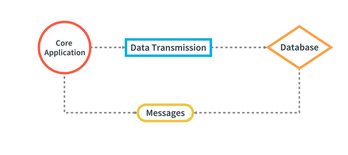
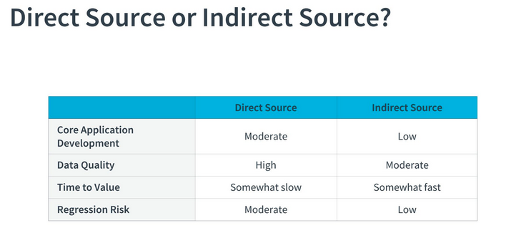
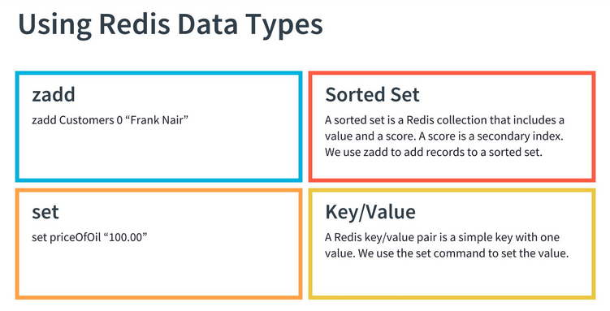

# Redis, Base64 and JSON #

Why is Redis important?

- Used by a lot of companies
- Great for rapid prototyping of new applications
- It can take you well beyond a proof of concept, all the way to production without having to create or maintain schemas
- Later you can create a structured schema, and migrate to a relational database
- You can stick with Redis, and create a nightly extract for reports

Redis is super fast in terms of read/write execution and in the development process

**Base64 is the encoding of the Internet**

Example: `https://ordersometakeout.com?coordinates=ODIuODYyOMKwIFMsIDEzNS4wMDAwwrAgRQ==`

Translation: Deliver my takeout to these coordinates: 82.8628° S, 135.0000° E

- Base64 is used to make the text more readable by servers
- In this example, the URL has a long encoded string after coordinates=
- Decoded the string is the latitude and longitude where the takeout is needed

**From the Source to the Sink**

When reading information from a Kafka topic, the path it follows can look something like this:

- The source system transmits some data to Kafka
- Kafka transmits that same data to a topic without modification
- The sink, or receiving system, decodes the information that was encoded by the source system

**The Sink Transforms the Data**


| Encoded                    | Decoded                 |
| -------------------------- | ----------------------- |
| {"key":"dGVzdGtleQ=="}     | {"key":"testkey"}       |
| {"element":"dGVzdHZhbHVl"} | {"element":"testvalue"} |

Often the final consumer is responsible to transform the original system's data.

In the above example:

- The first message has a key and an encoded value
- The decoded value is "testkey"
- The second message has a key called "element", and an encoded value
- The decoded value is "testvalue" Once the sink has decoded the data, it can be used for processing

Typical Core Application





In the typical core app we need to decide whether:
- We want to modify the Core Application to transmit messages
- Or instead, use the database as the source of messages.




**Direct Source or Indirect Source**

When faced with the decision in this example of whether to stream directly from the source as a new project or to stream from the current database, should consider these implications:

- When streaming directly from the source, the quality is high
  - This is because it is directly written by the Core Application
  - The Time to Value can be slower
  - Time to Value is the time it takes for a customer to benefit from your service
  - The time to value can be slower due to coordination with the main development team who supports ongoing work on the core application
  - The team often has several high priority initiatives
- Regression risk of modifying the core application is moderate due to the critical role it has in performing business functions
- Choosing an indirect source can make Time to Value lower
  - Reducing development strain on the core team CLICK
  - Reducing risk to the main application
- An indirect source may have lower quality data because it is not directly produced by the core system


**Banking Application**

In this lesson, we will be dealing with a sample banking application that currently uses Redis for storing customer information:





**Redis QuickStart**

For resources on how to get started using Redis on your own system, see the [Redis QuickStart Guide](https://redis.io/topics/quickstart)

How to Install the Kafka Redis Source Connector

For more information on using the Kafka Redis Source Connector used in the lesson, see the [Forked Kafka Connect Redis Repository](https://github.com/scmurdock/kafka-connector-redis) I used to set up your workspace.


**How do you decode in Spark?**

**unbase64:** `unbase64(encodedStreamingDF.reservation).cast("string")`


More on PySpark SQL Functions

To see the full list of possible SQL functions that come with PySpark, see the [PySpark SQL Module](https://spark.apache.org/docs/latest/api/python/pyspark.sql.html)


## Sink a Sbuset of JSON ##

**Select Using Spark**

There are two main functions used for selecting data in Spark Streaming: .select and spark.sql.
.select

`truckReservationDF.select("reservationId", "truckNumber")`

Here is an example of using the `.select` method to select the columns `"reservationId"` and `"truckNumber"`. Notice the `.select` function accepts from one to many column names separated by a comma.

**spark.sql**

spark.sql("select reservationId, truckNumber from TruckReservation")

This is the same select using spark.sql. Notice the spark.sql function accepts valid SQL statements.


**Spark SQL Functions**

Here are some useful Spark SQL Functions. These can be used within the spark.sql function or within the .select function:

- to_json and from_json are for working with JSON
- unbase64 and base64 are for working with Base64 encoded information.
- split is for separating a string of characters

We have worked with to_json, from_json, unbase64 so far.

### Using the Split Function - First Name ###

**Sample Data**

```python
{
"customerName":"June Aristotle",
"email":"June.Aristotle@test.com",
"birthDay":"1948-01-01"
}

```

**Example Code**

```python
split(customerStreamingDF.customerName," ")\
.getItem(0) \
.alias("firstName") \
```


In this case the output would be: `{ "firstName": "June"}`


**For the email domain**

```python
split(customerStreamingDF.email,"@") \

.getItem(1) \

.alias("emailDomain") \
```

### Using to_json ###


You have a DataFrame called truckStatusDF that contains several fields including "statusTruckNumber". You want to prepare to sink the DataFrame by converting it to JSON. Kafka also expects a key for every message:


```python
truckStatusDF \
.selectExpr(
"cast(statusTruckNumber as string) as key", 
"to_json(struct(*)) as value"
) 
```


### Sink it to Kafka ###

Now that we got the key and value fields in a DataFrame, you can sink to a Kafka topic:


```python
truckStatusDF \
.selectExpr(
"cast(statusTruckNumber as string) as key",
"to_json(struct(*)) as value"
) \
.writeStream \
.format("kafka") \
.option("kafka.bootstrap.servers", "kafkabroker.besthost.net:9092")\
.option("topic", "truck-status")\
.option("checkpointLocation","/tmp/kafkacheckpoint")\
.start()\
.awaitTermination()
```

**more on PySpark SQL Functions**


To see the full list of possible SQL functions that come with PySpark, see the [PySpark SQL Module](https://spark.apache.org/docs/latest/api/python/pyspark.sql.html)


### Edge Cases ###

What if you subscribe to the wrong Kafka topic in your Spark application and then correct it later? You may run into the error:


```python

Current committed Offsets: {KafkaV2[Subscribe[topic-name]]: {'wrong-topic-name':{'0':0}}}

Some data may have been lost because they are not available in Kafka any more; 
either the data was aged out by Kafka or the topic may have been deleted
before all the data in the topic was processed. If you don't want your 
streaming query to fail on such cases, set the source option
"failOnDataLoss" to "false."
```

In this case, simply add the option failOnDataLoss to your .writeStream as below:

```python
checkinStatusDF.selectExpr("cast(statusTruckNumber as string) as key", "to_json(struct(*)) as value") \
    .writeStream \
    .format("kafka") \
    .option("kafka.bootstrap.servers", "localhost:9092")\
    .option("topic", "checkin-status")\
    .option("checkpointLocation","/tmp/kafkacheckpoint")\
    .option("failOnDataLoss","false")\    
    .start()\
    .awaitTermination()
```


