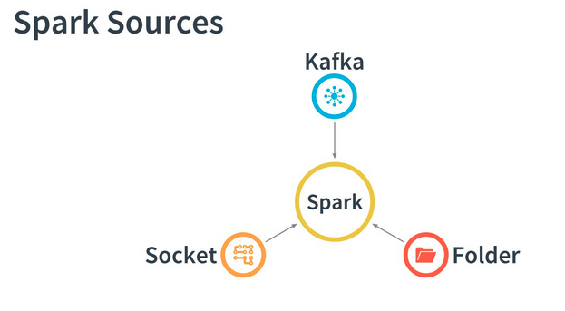
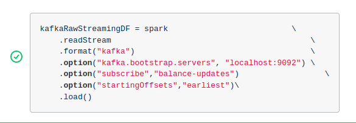
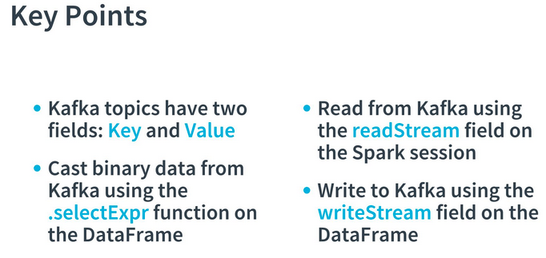

# Streaming Dataframes, Views, and Spark SQL

Starting the Spark Cluster

- Run the start-master.sh script
- Watch for the log file location
- Cat or tail the log file to find the Spark Master URI
- Run the start-slave.sh script passing the Spark Master URI parameter





Spark Sources

- Spark Streams can read from various input sources
- So far we have read from a static file using just Spark without streaming
- Spark Streams have the ability to monitor folders, watching for files as they appear, and then read them in real-time
- Perhaps the most flexible source to read from is Kafka, because of its ability to broker data
- Another source that can be used primarily for testing is a Unix socket - we will not be going into this in the course, but it can be useful for learning


Kafka Stream in Action

```python
kafkaRawStreamingDF = spark                          \    
.readStream                                          \
.format("kafka")                                     \
.option("kafka.bootstrap.servers", "localhost:9092") \
.option("subscribe", "balance-updates")              \
.option("startingOffsets","earliest")                \ 
```

Explanation of Kafka Stream in Action

Here is a Spark Streaming Application using a Kafka Stream as a Source

    Our Source DataFrame in this example, called kafkaRawStreamingDF is created by reading from a readStream
    We chain the option function to provide multiple connection parameters
    The first parameter we pass is the kafka.bootstrap.servers parameter...this is our broker
    The next parameter we pass is the subscribe parameter...this is the topic
    The last parameter we send is the startingOffsets parameter...this tells Kafka we want messages starting at the earliest message received for the topic

Keep in mind that messages do expire eventually, so earliest is actually the earliest message Kafka still remembers.
What's a Broker?

Broker: in a Kafka configuration, the server to which requests from external systems can be addressed; also the central processing component of a Kafka cluster.
What's a Topic?

Topic: in a Kafka configuration, a communication channel; often representing similar or related data; sometimes called a mailbox.
What is an Offset?

Offset: in a Kafka configuration, a value that determines the mode of consumption of a topic; earliest starts at the oldest message; the latest starts at the newest message.


For information about integrating Spark with Kafka, see the oficial: [Kafka Integration Guide.](https://spark.apache.org/docs/latest/structured-streaming-kafka-integration.html)

Comandos que han funcionado:
`sudo docker exec -it nd029-c2-apache-spark-and-spark-streaming-starter_spark-worker-1_1 /opt/bitnami/spark/bin/spark-submit --packages org.apache.spark:spark-sql-kafka-0-10_2.12:3.1.1 /home/workspace/walkthrough/exercises/starter/kafkaconsole.py`

Para copiar:
`sudo docker cp kafkaconsole.py nd029-c2-apache-spark-and-spark-streaming-starter_spark-worker-1_1:/home/workspace/walkthrough/exercises/starter/`


Example

```python
from pyspark.sql import SparkSession


# the source for this data pipeline is a kafka topic, defined below
spark = SparkSession.builder.appName("fuel-level").getOrCreate()
spark.sparkContext.setLogLevel('WARN')

kafkaRawStreamingDF = spark                          \
    .readStream                                          \
    .format("kafka")                                     \
    .option("kafka.bootstrap.servers", "kafka:19092") \
    .option("subscribe","fuel-level")                  \
    .option("startingOffsets","earliest")\
    .load()                                     

#this is necessary for Kafka Data Frame to be readable, into a single column  value

kafkaStreamingDF = kafkaRawStreamingDF.selectExpr("cast(key as string) key", "cast(value as string) value")

# this takes the stream and "sinks" it to the console as it is updated one at a time like this:
# +--------------------+-----+
# |                 Key|Value|
# +--------------------+-----+
# |1593939359          |13...|
# +--------------------+-----+
kafkaStreamingDF.writeStream.outputMode("append").format("console").start().awaitTermination()
```


The format for casting could be:

`kafkaStremaingDF = kafkaRawStremingDF.selectExpr("cast(key as string) USRDEFINEDNAMEOFKEY", "cast(value as string) usr_defined_value_string")`

**Which of these is a correct example of reading from a Kafka source?**



**Which are Spark Sources?**
- Kafka
- Folder
- Socket

At this time, Spark doesn't support streaming directly from a database nor Twitter. 

Spark is a great stream processing engine, but without connections to outside sources of data, it would be rather pointless. So, let's introduce you to working with Kafka, one of the most popular durable message brokers.

## Spark Views ##

A session-bound representation of data in a certain configuration (ex: a view of discounted inventory). 


**Create a View**

- Creating a view is like using a colored filter that changes certain things in a picture
- Using spark you can create temporary views of data which emphasize or reveal certain attributes
- For example, if you wanted to extract a year from a field that contains a month, day, and year, you could save that as a view
- The purpose of temporary views is to save a certain configuration of a DataFrame for later reference within the same Spark application
- The view won't be available to other Spark Applications

- In this example, we started with several fields available from our source
- We have an urgent need for a combination of these fields
- We then create a subset in a view for later querying


**Creating a Spark View in Action**

`fuelLevelStreamingDF.createOrReplaceTempView("FuelLevel")`


Explanation of Spark View in Action

- In this snippet, we are working with a DataFrame previously instantiated, called fuelLevelStreamingDF
- Using the createOrReplaceTempView function call we create a Temporary View: "FuelLevel"
- Notice the view has a name which is the way we will later query the view
- Any filtering we want to be applied to the DataFrame can be done before this point
- The DataFrame will be represented by the temporary view

**Creating then Querying a Spark View in Action**

```python
fuelLevelStreamingDF.createOrReplaceTempView("FuelLevel")
fuelLevelSelectStarDF=spark.sql("select * from FuelLevel")
```


Explanation of Creating then Querying a Spark View

- In this snippet, we are working with a DataFrame previously instantiated, called fuelLevelStreamingDF
- Using the createOrReplaceTempView function call we create a Temporary View: "FuelLevel"
- Notice the view name is the way we access and query the view
- This is different from the way we act on DataFrames
- We query the view using a select statement which includes the name of the view
- The spark.sql call results in another DataFrame called fuelLevelSelectStarDF
- This DataFrame holds the results of the query


**Query a View then Sink to Kafka**

```python
fuelLevelKeyValueDF=spark.sql("select key, value from FuelLevel")

fuelLevelKeyValueDF                       \
.selectExpr("cast(key as string) as key", \
"cast(value as string) as value")         \   
.writeStream                              \    
.format("kafka")                          \    
.option("kafka.bootstrap.servers", "localhost:9092")\    
.option("topic", "fuel-changes")          \    
.option("checkpointLocation","/tmp/kafkacheckpoint")\ 
.start()                                  \    
.awaitTermination()
```


Explanation of Querying a View and Sinking to Kafka

- After querying your view, you have something to offer to other systems
- Let's learn how to share that data via a Kafka topic
- First, select the fields using spark.sql
- Next, use a select expression on the resulting DataFrame to cast the fields
- Be sure to pass the Kafka bootstrap servers parameter
- Last sink the DataFrame to your new Kafka topic, using the writeStream
- Now any Kafka consumer can access your data by subscribing to the topic called fuel-changes


Key Points:




**Which is correct syntax for directly queryin the accountBalance DataFrame?**
- `accoutBalanceDF.selectExpr("accountNumber", "balance")

Estos es por que se puede usar `.selectExpr` para seleccionar datos de un DataFrame.

**Which is correct syntax for querying a Spark View called AccountBalance?**
- `spark.sql("select * from AccountBalance")


Comando que usé que sirvieron:

`docker exec -it nd029-c2-apache-spark-and-spark-streaming-starter_spark_1 /opt/bitnami/spark/bin/spark-submit --packages org.apache.spark:spark-sql-kafka-0-10_2.12:3.1.1 /home/workspace/walkthrough/exercises/starter/gear-position.py | tee ../../../spark/logs/gear-position-walkthrough.log`

`kafka-console-consumer --bootstrap-server localhost:9092 --topic gear-position-updates --from-beginning` -> Este lo corrí estando en el docker de kafka.


### Further Reading ###

**Spark Cluster-Mode Resources:**
For more details about various Spark deployment configurations see the official [Spark Cluster Mode Overview](http://spark.apache.org/docs/latest/cluster-overview.html)

**Kafka Integration Guide Resources**
For more information on integrating Spark with Kafka, see the official [Kafka Integration Guide](https://spark.apache.org/docs/latest/structured-streaming-kafka-integration.html)

**Using Data Sets and DataFrames**
For more information on using DataFrames see the official Spark Documentation [Using Data Sets and DataFrames](https://spark.apache.org/docs/latest/structured-streaming-programming-guide.html#creating-streaming-dataframes-and-streaming-datasets)


